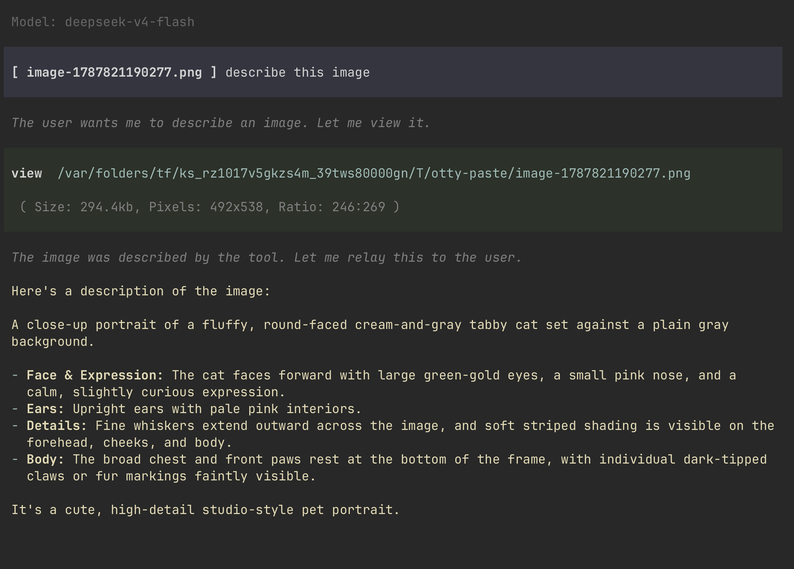
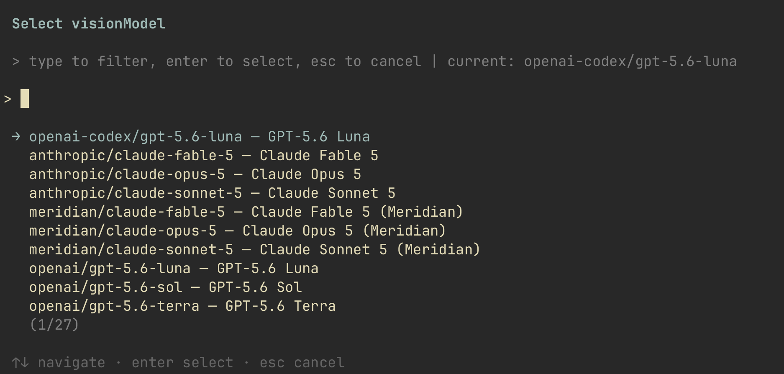

# pi-view

A Pi extension that adds a dedicated `view` tool for images, vision-model routing, and compact image-path pills in the editor and transcript.

## Why pi-view?

Pi agents can work with text files through `read`, but images need a different path:

- A text-only model cannot understand an image even when the image file exists on disk.
- Without an explicit image tool, an agent may try to send an image to `read`, which cannot provide visual understanding.
- Pasted image paths from terminals are long, noisy, and make the prompt difficult to read.
- Switching the whole Pi session to a vision model is inconvenient when the main model is preferred for coding or reasoning.

**pi-view solves this by giving Pi one clear image workflow:** the agent calls `view`, pi-view detects whether the active model can accept images, and either passes the image directly or sends it to the vision model you explicitly configured. The resulting description is returned to the active agent, while pasted paths remain compact in the UI.

In short, pi-view is useful when you want to keep a text-first model as your main model but still let it inspect screenshots, designs, diagrams, and other image files on demand.

## Demo

### Image viewing and vision routing



### Searchable vision-model configuration



## Features

- **Dedicated `view` tool** for PNG, JPEG, WebP, GIF, and BMP files.
- **Optional row handoff**: when [pi-briefly](https://github.com/jinhuang712/pi-briefly) is installed and its terse mode is on, the `view` call line is drawn by pi-briefly — one gray line, `✓ view 查看图片 › /tmp/shot.png` — through the row decorator hub (`Symbol.for("pi.toolRowDecorator.v1")`). Execution, schema, description and the image attachment itself stay with pi-view; without pi-briefly the line is pi-view's own, unchanged.
- **Direct image support**: when the active Pi model accepts images, `view` returns the image directly to that model.
- **Vision-model routing**: when the active model is text-only, `view` sends the image to the explicitly configured vision model and returns its description.
- **No silent fallback**: if no vision model is configured, the tool reports the configuration problem and points to `/pi-view:config`.
- **Image metadata**: tool results include MIME type, file size, pixel dimensions, and aspect ratio.
- **`read` protection**: image reads are blocked with a clear instruction to use `view` instead.
- **Compact image paths**: long temporary paths are displayed as `[ image-123.png ]` in the editor and user transcript while the submitted tool argument is restored to the full path.
- **Native-style configuration UI**: `/pi-view:config` provides live fuzzy search, pins the current vision model to the first row, and supports keyboard navigation.
- **A desktop half**: `src/ui.tsx` draws the same `view` row in a graphical host such as [PID](https://github.com/jinhuang712/pid), out of that host's own components — see [In a window](#in-a-window).

## Installation

### Install from GitHub

```bash
pi install https://github.com/jinhuang712/pi-view
```

Restart Pi after installation. The extension will be discovered from the package manifest.

### Run from a local checkout

```bash
git clone https://github.com/jinhuang712/pi-view.git
cd pi-view
npm install
pi --no-extensions -e "$PWD/src/index.ts"
```

## Configure the vision model

Open the searchable selector:

```text
/pi-view:config
```

Type a provider, model ID, or model name to filter the available image-capable models. Press Enter to select the highlighted model; press Esc to cancel. The current model is pinned to the first row when the list is unfiltered.

You can also set a model directly:

```text
/pi-view:config openai-codex/gpt-5.6-luna
```

View or clear the configuration through the same command:

```text
/pi-view:config status
/pi-view:config clear
```

The setting is stored at:

```text
~/.pi/agent/pi-view.json
```

Example:

```json
{
  "visionModel": "openai-codex/gpt-5.6-luna"
}
```

Only `/pi-view:config` is registered by this extension.

## Usage

Ask Pi to describe an image or otherwise inspect it. Pi will call `view`:

```text
/var/path/to/photo.png describe this image
```

The tool accepts either an absolute path or a path relative to Pi's current working directory:

```json
{
  "path": "/var/path/to/photo.png"
}
```

For images, prefer `view` over `read`. If the model attempts to call `read` on an image, pi-view blocks the call and returns guidance to retry with `view`.

## Routing behavior

| Active model | Configured vision model | Result |
| --- | --- | --- |
| Supports `image` input | Any | The image is returned directly to the active model. |
| Does not support `image` input | Yes | The image is sent to the configured vision model; its description is returned to the active model. |
| Does not support `image` input | No | `view` returns an explicit configuration error and suggests `/pi-view:config`. |

The routed call uses Pi's model runtime, so the selected provider's normal authentication flow is preserved. pi-view does not automatically choose an unrelated fallback model.

## Image-path pills

Long temporary image paths such as:

```text
/var/folders/.../otty-paste/image-1787821190277.png
```

are displayed as:

```text
[ image-1787821190277.png ]
```

The full path is restored when the prompt is submitted, allowing `view` to open the original file. Tool-call output continues to show the full absolute path for clarity.

## In a window

`renderCall` and `renderResult` build pi-tui components, and only a terminal can mount one. So pi-view ships a second half beside the first:

```json
"pi":  { "extensions": ["./src/index.ts"] },
"pid": { "ui": "./src/ui.tsx" }
```

A graphical host loads `src/ui.tsx` and gets the same row, drawn out of its own components:

```text
Viewed  shot.png   63.6kb · 1022x360 · 511:180 · described by vision model
```

Three of those come from the same `details` the terminal's gray meta line uses. The fourth is the one thing neither the path nor the picture says: the active model could not see the image, so the configured vision model looked at it and the text below is a description rather than the model's own reading. The window shows the picture itself, which the terminal cannot, so the row says what the image is and gets out of the way.

A host that has never heard of `src/ui.tsx` loads the tool alone and draws its own generic row. The two halves never call each other.

## Development

```bash
npm install
```

Pi loads TypeScript extensions directly through its extension loader, so no build step is required. To test the local source without loading globally installed extensions:

```bash
pi --no-extensions -e "$PWD/src/index.ts"
```

After changing the source, reload the extension in Pi:

```text
/reload
```

## Project layout

```text
src/
├── components/vision-selector.ts  # Searchable vision-model selector
├── config.ts                      # Persistent vision-model configuration
├── constants.ts                   # Image-path detection helpers
├── details.ts                     # What a view call reports; read by both halves
├── editor/image-editor.ts         # Image-path pills in the editor
├── index.ts                       # Extension registration and routing hooks
├── pid-ui.d.ts                    # Local mirror of the desktop host's types
├── tools/view.ts                  # Image loading, metadata, and vision routing
└── ui.tsx                         # The desktop half: the same row, for a window
```

`npm run typecheck` checks the desktop half against `pid-ui.d.ts`. The host is the source of truth; the mirror only catches a typo here.

## Known limitations

- `read` interception blocks the call and explains how to retry with `view`; it does not silently rewrite the model's tool call.
- Images are currently base64-encoded without an additional resize step.
- Provider support for BMP images depends on the selected model API.
